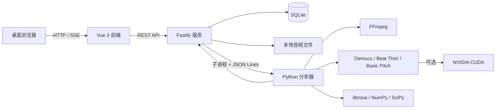
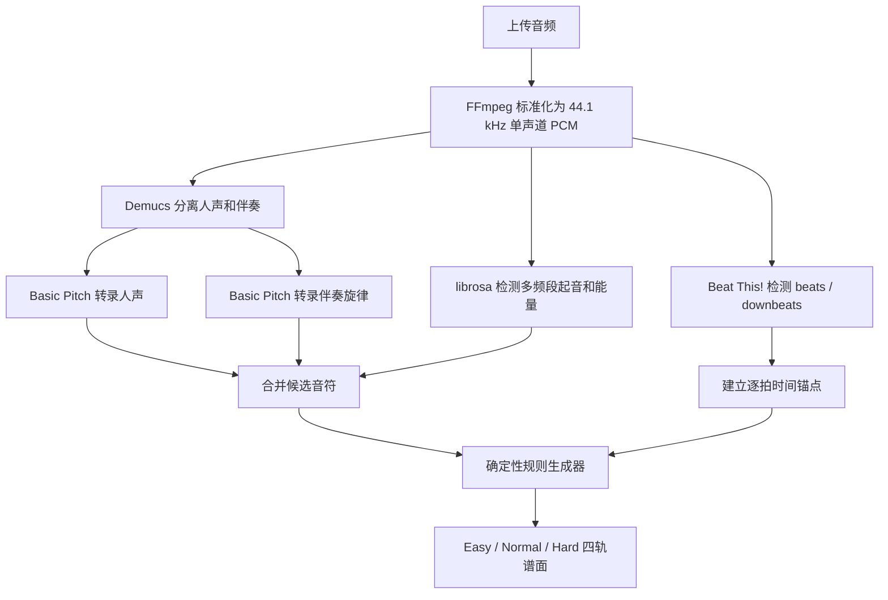

# BeatForge 技术栈说明

## 1. 项目概述

BeatForge 是一个完全在本地运行的四轨网页音游与自动谱面工作台，提供以下完整流程：

1. 上传本地歌曲；
2. 分离人声和伴奏；
3. 检测节拍、人声音节、主旋律与间奏节奏；
4. 自动生成简单、普通、困难三档四轨谱面；
5. 在可视化编辑器中修改节拍锚点和音符；
6. 使用类 3D 透视轨道游玩谱面；
7. 按谱面版本保存本地最佳成绩。

项目不依赖 Docker、云存储、账号系统或外部数据库，歌曲、谱面、分析结果和成绩均保存在本机。

## 2. 总体架构



项目采用 npm workspaces 单仓库结构：

```text
beatforge/
├─ apps/
│  ├─ web/                 # Vue 3 网页端、编辑器和游戏
│  └─ server/              # Fastify API、任务队列和持久化
├─ packages/
│  └─ shared/              # 前后端共享类型、校验和时间换算
├─ services/
│  └─ analyzer/            # Python 音频分析与谱面生成
├─ scripts/                # Windows 本地安装、启动和 GPU 配置脚本
└─ data/                   # SQLite、音频和 AI 模型等本地数据
```

## 3. 前端技术栈

| 技术 | 当前版本 | 用途 |
| --- | --- | --- |
| Vue | 3.5.x | 页面和组件开发 |
| TypeScript | 5.9.x | 类型安全 |
| Vite | 7.1.x | 开发服务器和生产构建 |
| Vue Router | 4.5.x | 曲库、编辑器和游戏页面路由 |
| Pinia | 3.0.x | Vue 状态管理基础设施 |
| PixiJS | 8.12.x | 编辑器和游戏的 WebGL 画面渲染 |
| Web Audio API | 浏览器原生 | 音频解码、播放和高精度游戏时钟 |
| Lucide Vue Next | 0.542.x | 界面图标 |
| Vitest | 3.2.x | 前端单元测试 |

### 3.1 页面组成

- `LibraryView`：歌曲上传、曲库、分析进度、重新生成和删除。
- `EditorView`：波形、四轨时间轴、节拍网格、音符编辑和自动保存。
- `GameView`：音频调度、键盘输入、判定、计分、暂停、重开和 Autoplay。
- `EditorBoard`：使用 PixiJS 绘制可缩放四轨编辑画布。
- `GameBoard`：使用 PixiJS 绘制上窄下宽的类 3D 透视轨道和音符。

### 3.2 游戏渲染与时钟

- PixiJS 强制优先使用 WebGL，并启用高性能 GPU 偏好。
- 静态轨道与动态音符分层绘制，减少每帧重复创建场景对象。
- 下落位置采用非线性透视函数，音符接近判定线时视觉速度加快。
- 下落速度支持 1～10 档，速度改变的是音符可见提前量，不改变歌曲播放速度。
- 游戏时间以 `AudioContext.currentTime` 为主时钟；`requestAnimationFrame`/Pixi ticker 只负责显示，低帧率不会改变实际判定时间。
- 设备延迟通过统一的毫秒偏移加入游戏时间。

### 3.3 本地浏览器存储

浏览器 `localStorage` 只保存玩家设置：

- D/F/J/K 等键位；
- 主音量；
- 1～10 档下落速度；
- 设备延迟校准值。

歌曲、谱面和成绩不以浏览器存储作为数据源。

## 4. 服务端技术栈

| 技术 | 当前版本 | 用途 |
| --- | --- | --- |
| Node.js | 24 或更高 | 服务端运行时，同时提供内置 `node:sqlite` |
| Fastify | 5.5.x | REST API 和静态资源服务 |
| `@fastify/multipart` | 9.2.x | 音频上传 |
| `@fastify/static` | 8.2.x | 生产环境网页静态资源 |
| `@fastify/cors` | 11.1.x | 本地开发跨域支持 |
| SQLite | Node 内置 | 歌曲、任务、谱面版本和最佳成绩 |
| TSX | 4.20.x | TypeScript 服务端开发热重载 |

### 4.1 服务端职责

- 校验 MP3、WAV、FLAC、OGG、M4A 上传文件；
- 默认限制单文件 200 MB、歌曲最长 20 分钟；
- 支持 HTTP Range 音频流，便于浏览器拖动和分段播放；
- 维护单并发本地分析任务队列；
- 通过子进程运行 Python 分析器；
- 读取 Python 输出的 JSON Lines 进度事件；
- 通过 SSE 将分析进度推送到网页；
- 服务重启后把未完成任务重新放回队列；
- 对谱面编辑执行基础版本号冲突检查；
- 保留最近 20 个旧谱面版本；
- 按歌曲、难度和谱面版本保存最佳成绩。

### 4.2 SQLite 数据

数据库文件位于 `data/beatforge.db`，主要数据表如下：

| 数据表 | 内容 |
| --- | --- |
| `songs` | 歌曲信息、音频路径和分析状态 |
| `jobs` | 分析任务、阶段、进度和错误信息 |
| `chart_sets` | 当前谱面文档和版本号 |
| `chart_revisions` | 最近 20 个历史谱面快照 |
| `analyses` | BPM、节拍可信度、波形和警告 |
| `scores` | 各谱面版本的最佳成绩 |

SQLite 启用 WAL 日志模式和外键约束。删除歌曲时，关联的任务、谱面、分析数据和成绩通过外键级联删除，音频文件同时从本地磁盘清理。

## 5. Python 音频分析技术栈

| 技术 | 用途 |
| --- | --- |
| Python 3.10 x64 | AI 音频分析运行时 |
| FFmpeg / imageio-ffmpeg | 解码并标准化音频 |
| librosa | 起音强度、频谱、RMS、波形和节拍辅助分析 |
| NumPy | 音频数组与数值计算 |
| SciPy | 信号处理基础能力 |
| SoundFile | PCM 音频读取 |
| Demucs `htdemucs` | 人声和伴奏分离 |
| Beat This! | AI 逐拍和强拍跟踪 |
| Basic Pitch | 人声/伴奏主旋律音高与音符区间转录 |
| PyTorch / Torchaudio | Demucs、Beat This! 模型推理与 CUDA 支持 |
| ONNX Runtime GPU | Basic Pitch ONNX GPU 推理 |

### 5.1 分析流水线



当前不是单纯按照固定 BPM 等距离采点，而是保存每一个 beat 的实际时间锚点。音符以浮点 `beat` 保存，播放时在相邻锚点之间做线性换算，因此能够表达速度变化和局部节拍漂移。

### 5.2 人声与间奏采点策略

当前生成器版本为 `rules-v7-post-filter-interlude-coverage`，采用以下混合策略：

1. 从分离后的人声频谱起音与 Basic Pitch 音符开始位置中估计歌词音节；
2. 有人声时优先使用人声音节和主旋律候选；
3. 无人声时使用伴奏旋律、鼓点/频谱起音和节拍锚点；
4. Demucs 人声轨中的微弱伴奏串音不能单独作为“有人声”的依据，必须同时存在转录到的人声区间；
5. 难度筛选完成后再次检查谱面，若两个有效事件之间仍出现超过 2 秒的空白，则沿节拍锚点补充间奏音符；
6. 补点不会放入已经被长按音符覆盖的区间。

### 5.3 三档难度规则

- `easy`：较高强度门限、更大的最小音符间隔、间奏通常隔拍补点、无双押或极少复杂组合。
- `normal`：保留更多人声音节和半拍信息，允许少量双押，间奏按逐拍覆盖。
- `hard`：保留最密集的人声音节、细分起音与双押，最小采点间隔最短。

谱面生成使用歌曲特征摘要、难度和生成器版本构造固定随机种子。相同音频、相同特征和相同生成器版本会得到相同的轨道分配结果。

### 5.4 回退机制

- Beat This! 无法使用时，分析器会使用 librosa 的节拍能力继续生成。
- 完全无法检测可靠节拍时，使用 120 BPM 回退网格并给出需要人工校准的警告。
- AI 模型失败时，尽可能降级为传统音频特征分析，而不是让整个任务直接不可用。
- 未配置系统 FFmpeg 时，Python 使用 `imageio-ffmpeg` 自带的可执行文件进行标准化。

## 6. GPU 与 CUDA

GPU 是可选加速项，不影响项目基本功能。当前 GPU 环境使用：

- PyTorch 2.11.0；
- Torchaudio 2.11.0；
- CUDA 12.6 运行时 wheel；
- ONNX Runtime GPU 1.20.2。

GPU 主要加速 Demucs 人声分离、Beat This! 节拍跟踪和 Basic Pitch ONNX 推理。程序会检查 `torch.cuda.is_available()` 和 ONNX CUDA Provider；CUDA 不可用或显存不足时会尝试回退到 CPU，并在必要时缩小 Demucs 分段长度。

安装 GPU 依赖：

```powershell
npm run setup:gpu
```

验证 GPU：

```powershell
.\.venv-ai\Scripts\python.exe services\analyzer\verify_gpu.py
```

系统仍需正确安装与显卡兼容的 NVIDIA 驱动，但通常不需要单独安装完整 CUDA Toolkit，因为 PyTorch wheel 已携带所需 CUDA 运行时组件。

## 7. 谱面数据模型

核心格式由 `packages/shared` 在前后端共享：

```ts
type Difficulty = "easy" | "normal" | "hard";
type NoteType = "tap" | "hold";

interface TimingAnchor {
  beat: number;
  timeMs: number;
  strength?: number;
  downbeat?: boolean;
}

interface ChartNote {
  id: string;
  lane: 0 | 1 | 2 | 3;
  type: NoteType;
  beat: number;
  endBeat?: number;
  offsetMs?: number;
}

interface ChartSet {
  schemaVersion: 1;
  songId: string;
  revision: number;
  generatorVersion: string;
  laneCount: 4;
  timing: {
    meter: 4;
    anchors: TimingAnchor[];
  };
  charts: Record<Difficulty, { notes: ChartNote[] }>;
  warnings: string[];
}
```

`offsetMs` 用于保存无法安全吸附到节拍网格的微小时间偏移，当前允许范围为 ±180 ms。

## 8. 编辑器实现

编辑器使用 Vue 管理交互状态，使用 PixiJS 绘制时间轴和音符，主要功能包括：

- 1/4、1/8、1/12、1/16 等节拍吸附；
- 更细的横向时间缩放；
- 点击、框选和多选；
- 拖动音符改变时间和轨道；
- Tap/Hold 类型与长按终点编辑；
- 毫秒级偏移编辑；
- 复制、粘贴、删除；
- 最多 100 步前端撤销/重做；
- 波形定位、区间循环、节拍器和打击音；
- 0.5、0.75、1 倍试听；
- 停止操作 1.5 秒后自动保存。

保存接口提交 `baseRevision`。如果其他标签页已经提交了更新，服务端返回 HTTP 409，防止旧页面覆盖新谱面。

## 9. 游戏判定与计分

- 默认键位：D / F / J / K；
- Perfect：±45 ms；
- Great：±90 ms；
- Good：±140 ms；
- 超出窗口：Miss；
- 长按头尾分别参与判定；
- 最终成绩归一化为 1,000,000 分；
- 显示准确率、最大连击和各判定数量；
- Autoplay 可通过按钮或 `A` 键开启，但不会保存最佳成绩。

最佳成绩与谱面 `revision` 绑定。谱面被编辑或重新生成后，旧成绩仍保留在数据库中，但不会作为当前版本的最佳成绩显示。

## 10. API 通信

主要接口如下：

| 方法 | 路径 | 用途 |
| --- | --- | --- |
| `GET` | `/api/health` | 服务健康检查 |
| `POST` | `/api/songs` | 上传歌曲并创建分析任务 |
| `GET` | `/api/songs` | 获取曲库 |
| `GET` | `/api/songs/:id` | 获取歌曲和分析详情 |
| `GET` | `/api/songs/:id/audio` | Range 音频播放 |
| `POST` | `/api/songs/:id/generations` | 重新生成三档谱面 |
| `GET` | `/api/jobs/:id` | 获取任务状态 |
| `GET` | `/api/jobs/:id/events` | 订阅 SSE 分析进度 |
| `GET` | `/api/songs/:id/chart-set` | 获取当前完整谱面 |
| `PUT` | `/api/songs/:id/chart-set` | 保存编辑后的谱面 |
| `GET` | `/api/songs/:id/scores` | 获取当前版本最佳成绩 |
| `POST` | `/api/songs/:id/scores` | 提交成绩 |
| `DELETE` | `/api/songs/:id` | 删除歌曲和关联数据 |

开发环境下 Vite 运行在 `http://localhost:5173`，Fastify API 运行在 `http://localhost:8787`，前端通过 Vite 代理访问 `/api`。

## 11. 本地开发环境

### 11.1 环境要求

- Windows 10/11；
- Node.js 24 或更高；
- npm；
- Python 3.10 x64；
- 可选：NVIDIA 显卡和兼容驱动。

### 11.2 首次安装

```powershell
npm run setup:local
```

安装脚本会：

1. 安装 npm workspace 依赖；
2. 创建基础 `.venv`；
3. 创建 Python 3.10 的 `.venv-ai`；
4. 安装音频和 AI 依赖；
5. 下载并缓存 Demucs、Beat This! 和 Basic Pitch 模型。

### 11.3 启动

```powershell
powershell -ExecutionPolicy Bypass -File scripts\start-local.ps1
```

然后访问：

- 网页：<http://localhost:5173>
- API 健康检查：<http://localhost:8787/api/health>

### 11.4 环境变量

| 环境变量 | 默认值 | 说明 |
| --- | --- | --- |
| `PORT` | `8787` | Fastify 端口 |
| `HOST` | `0.0.0.0` | Fastify 监听地址 |
| `DATA_DIR` | 项目下的 `data` | 本地数据目录 |
| `PYTHON_BIN` | `.venv` 或启动脚本指定的 `.venv-ai` | Python 可执行文件 |
| `TORCH_HOME` | `data/models` | PyTorch 模型缓存目录 |
| `FFMPEG_BIN` | 自动查找 | 可选的 FFmpeg 路径 |
| `FFPROBE_BIN` | `ffprobe` | FFprobe 命令或路径 |
| `MAX_UPLOAD_MB` | `200` | 上传大小限制 |
| `MAX_DURATION_SECONDS` | `1200` | 歌曲时长限制 |

## 12. 构建与测试

```powershell
npm run typecheck     # 前后端 TypeScript 类型检查
npm test              # shared、server、web 的 Vitest 测试
npm run test:python   # Python 谱面生成单元测试
npm run build         # 构建 shared、server 和 web
```

Python 测试重点覆盖：

- 三档难度密度差异；
- 确定性输出；
- 轨道、长按和时间偏移合法性；
- 网格外真实起音保留；
- 人声区间对伴奏节奏的抑制；
- 人声分离串音不能遮蔽间奏；
- 难度筛选后长空白自动补点。

前端测试重点覆盖判定窗口、归一化计分、1～10 档速度范围和透视下落曲线。

## 13. 本地文件与 Git

以下目录是安装依赖、模型或运行数据，不应提交到 Git：

```gitignore
node_modules/
.venv/
.venv-ai/
.npm-cache/
.pip-cache/
data/
apps/*/dist/
packages/*/dist/
```

需要提交的核心内容包括 `apps`、`packages`、`services`、`scripts`、根目录 npm 配置、测试代码以及本技术栈文档。

## 14. 当前边界

- 首版只面向最新桌面版 Chrome/Edge；
- 固定四轨和 4/4 拍号；
- 不支持移动端触控、滑键、方向键或视觉事件轨；
- 不提供账号、云同步、排行榜和公开分享；
- 分析任务为单机单并发；
- AI 采点能够提高节拍、人声与旋律信息质量，但最终谱面仍由确定性规则生成器编排，并非端到端神经网络直接输出整张谱面。
